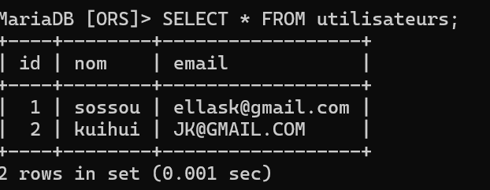
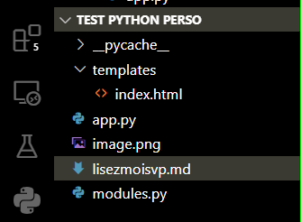

# Documentation : Application Flask avec MariaDB par ELKAST ORSINI


### ce dont vous devez connaitre avant de commencer

**Créer et exécuter un fichier .py**

**Utiliser une fonction**

**Installer un module avec pip**

**Lire/écrire dans un fichier**

**Comprendre une requête SQL simple**

**si vous n avez ces bases la documentation sera un torture intellectuelle pour vous** 

# RESULTAT DE LA BASE DE DONNE


# ARCHITECTURE DES DOCUMENTS ET FICHIERS


## 1. **Présentation du projet**

Ce projet est une petite application web en Python avec Flask qui permet :
- D’enregistrer des utilisateurs (nom et email) dans une base de données MariaDB.

- D’afficher la liste des utilisateurs enregistrés.

Le code est organisé en deux fichiers principaux :
- **modules.py** : pour les fonctions qui gèrent la base de données.

- **app.py** : pour l’application Flask (les routes web).

- **templates/index.html** : pour le formulaire HTML.


# Explication de chaque étape 
- NB:Le cursor est l’outil qui permet à ton programme Python d’envoyer des demandes à la base de données et de recevoir les réponses.

# exemple:

Envoyer des requêtes
Quand tu veux communiquer avec la base de données, tu dois passer par un cursor.
Exemple :

python
cursor.execute("SELECT * FROM utilisateurs")
Ici, le cursor envoie la requête SQL à la base.

# Récupérer les résultats
Après avoir exécuté une requête de type SELECT, tu utilises le cursor pour lire les résultats :

python
resultats = cursor.fetchall()
# Sécurité
Le cursor permet aussi d’utiliser des paramètres dans les requêtes, pour éviter les failles de sécurité (injections SQL) :

python
cursor.execute("INSERT INTO utilisateurs (nom, email) VALUES (%s, %s)", (nom, email))

1. conn = mysql.connector.connect(**config)
Rôle : Cette ligne crée la connexion entre ton programme Python et ta base de données MariaDB/MySQL.

Pourquoi ? : Sans cette connexion, ton programme ne peut pas accéder à la base de données.

Comment ? :

config est un dictionnaire qui contient les informations nécessaires (utilisateur, mot de passe, nom de la base, etc.).

**config** permet de passer chaque clé/valeur du dictionnaire comme argument à la fonction connect.

2. cursor = conn.cursor()
Rôle : **Le curseur (cursor)** est un objet qui permet d’exécuter des requêtes SQL sur la base de données.

Pourquoi ? : Tu as besoin d’un curseur pour envoyer des instructions **(comme INSERT, SELECT, etc.)** à la base de données.

***Image mentale : Imagine le curseur comme un stylo qui écrit ou lit dans la base  c est tout.***

3. cursor.execute("INSERT INTO utilisateurs (nom, email) VALUES (%s, %s)", (nom, email))

**Rôle :** Exécute la requête SQL qui ajoute un nouvel utilisateur dans la table utilisateurs.

**Pourquoi ?** : C’est cette commande qui enregistre les données saisies par l’utilisateur.

**Sécurité :** Les %s et le tuple (nom, email) permettent d’éviter les injections SQL (c’est plus sûr que de mettre directement les valeurs dans la requête).

4. conn.commit()
Rôle : Valide les changements faits dans la base de données.

**Pourquoi ?**: Sans commit(), l’ajout du nouvel utilisateur ne sera pas enregistré définitivement dans la base.

**Image mentale**: C’est comme “sauvegarder” un document après l’avoir modifié.

5. cursor.close()
**Rôle** : Ferme le curseur.

**Pourquoi ?** : C’est une bonne pratique pour libérer les ressources utilisées par le curseur, une fois que tu as fini de t’en servir.

6. conn.close()
Rôle : Ferme la connexion à la base de données.

**Pourquoi ?** : Pour libérer la connexion et éviter d’en avoir trop ouvertes en même temps (ce qui peut ralentir ou bloquer la base).

# Résumé de manniere schématique du processus 
- connect → Se connecter à la base.

- cursor → Préparer un outil pour envoyer des requêtes.

- execute → Envoyer la requête SQL (ici, ajouter un utilisateur).

- commit → Sauvegarder les changements.

- close (cursor) → Fermer l’outil d’écriture/lecture.

- close (connexion) → Fermer la porte d’accès à la base.

# Pourquoi suivre cet ordre ?
Si tu oublies commit(), tes modifications ne seront pas enregistrées.

# nb:
Si tu oublies de fermer le curseur ou la connexion, tu risques d’avoir des “fuites” de ressources (ton programme ou la base peuvent ralentir ou planter).

Toujours ouvrir, utiliser, puis fermer : c’est une règle de base en programmation avec les bases de données.


## 2. **modules.py**  
Ce fichier contient les fonctions pour communiquer avec la base de données.

```python
import mysql.connector

def envoyer_donnees(nom, email, config):
    """
    Enregistre un nouvel utilisateur dans la base de données.
    - nom : le nom de l'utilisateur (chaîne de caractères)
    - email : l'email de l'utilisateur (chaîne de caractères)
    - config : dictionnaire de configuration pour la connexion à la base
    """
    conn = mysql.connector.connect(**config)  # Connexion à la base
    cursor = conn.cursor()  # Création d'un curseur pour exécuter les requêtes SQL
    cursor.execute("INSERT INTO utilisateurs (nom, email) VALUES (%s, %s)", (nom, email))  # Insertion
    conn.commit()  # Sauvegarde des changements
    cursor.close()  # Fermeture du curseur
    conn.close()  # Fermeture de la connexion

def lire_donnees(config):
    """
    Récupère tous les utilisateurs enregistrés dans la base de données.
    - config : dictionnaire de configuration pour la connexion à la base
    Retourne : une liste de tuples (id, nom, email)
    """
    conn = mysql.connector.connect(**config)
    cursor = conn.cursor()
    cursor.execute("SELECT * FROM utilisateurs")  # Sélectionne tous les utilisateurs
    result = cursor.fetchall()  # Récupère tous les résultats
    cursor.close()
    conn.close()
    return result
```


## 3. **app.py**  
C’est le cœur de l’application web Flask.

```python
from flask import Flask, request, render_template
from modules import envoyer_donnees, lire_donnees

app = Flask(__name__)

# Configuration pour se connecter à la base de données
config = {
    'host': 'localhost',# LA MARCHINE SUR LEQUEL LES DONNE SON CREE ET EXPORTER
    'user': 'root', # C REST LE NOM D UTILISATEUR DE MA BASE DE DONNE MARIA DB J AI PAS CONFIGURER NI CREE UN AUTRE A PART CELUI DE L'INSTALLATION DE MARIA PAS DEFAUT ROOT
    'password': '',  # Mets ici ton mot de passe si tu en as un
    'database': 'ORS' #ICI C EST LA BASE DE DONNE QU J'AI CREE SOUS MARIA DB
}

@app.route('/')
def index():
    """
    Affiche la page d'accueil avec le formulaire d'inscription.
    """
    return render_template('index.html')

@app.route('/envoyer', methods=['POST'])
def envoyer():
    """
    Récupère les données du formulaire et les envoie à la base de données.
    """
    nom = request.form.get('nom')  # Récupère le nom envoyé par le formulaire
    email = request.form.get('email')  # Récupère l'email envoyé par le formulaire
    envoyer_donnees(nom, email, config)  # Envoie les données à la base
    return f"Données envoyées : {nom}, {email}"

@app.route('/afficher')
def afficher():
    """
    Affiche la liste de tous les utilisateurs enregistrés.
    """
    utilisateurs = lire_donnees(config)  # Récupère les utilisateurs depuis la base
    return render_template('afficher.html', utilisateurs=utilisateurs)

if __name__ == '__main__':
    app.run(debug=True)
```


## 4. **templates/index.html**  
C’est le formulaire HTML pour saisir le nom et l’email.

```html


    
    
    Enregistrement Utilisateur


    
        
        
        Envoyer
    


```


## 5. **templates/afficher.html**  
À créer pour afficher les utilisateurs (exemple de contenu) :

```html


    
    Liste des utilisateurs


    Utilisateurs enregistrés
    
        
            {{ user[1] }} ({{ user[2] }})
        
    


```


## 6. **Explications pour débutants**

- **Flask** : C’est un mini-framework qui permet de créer des sites web en Python.
- **Route (`@app.route`)** : C’est une URL de ton site. Par exemple, `/` c’est la page d’accueil, `/envoyer` c’est la page qui reçoit les données du formulaire.
- **render_template** : Sert à afficher une page HTML qui se trouve dans le dossier `templates`.
- **Formulaire HTML** : Permet à l’utilisateur de saisir son nom et son email.
- **modules.py** : Permet de séparer la logique de gestion de la base de données du reste du code, pour que ce soit plus propre et facile à maintenir.


## 7. **Comment utiliser ce projet ?**

1. **Lance MariaDB/MySQL et crée la base et la table** :
   ```sql
   CREATE DATABASE ORS;
   USE ORS;
   CREATE TABLE utilisateurs (
       id INT AUTO_INCREMENT PRIMARY KEY,
       nom VARCHAR(100),
       email VARCHAR(100)
   );
   ```

2. **Assure-toi d’avoir installé Flask et mysql-connector-python** :
   ```bash
   pip install flask mysql-connector-python
   ```

# Qu’est-ce que pip ?
pip est le gestionnaire de paquets officiel de Python.

Il permet d’installer, de mettre à jour ou de désinstaller des bibliothèques (modules) Python depuis le terminal ou l’invite de commandes.

Exemple d’utilisation :

Installer une bibliothèque : pip install nom_du_module

Désinstaller une bibliothèque : pip uninstall nom_du_module

Mettre à jour une bibliothèque : pip install --upgrade nom_du_module

# Qu’est-ce que Flask ?
Flask est un micro-framework web pour Python.

Il permet de créer facilement des sites web, des API, ou des applications web.

Il gère les routes, les templates HTML, les formulaires, etc.

Exemple :
Tu peux créer une page web en quelques lignes de code avec Flask.

# Qu’est-ce que mysql-connector-python ?
mysql-connector-python est une bibliothèque Python qui permet à ton code Python de se connecter à une base de données MySQL ou MariaDB.

Grâce à elle, tu peux envoyer des requêtes SQL (INSERT, SELECT, UPDATE, DELETE) à ta base de données directement depuis Python.

C’est ce module qui permet à tes fonctions dans modules.py de communiquer avec MariaDB.

# Pourquoi utiliser cette commande ?
La commande :

bash
pip install flask mysql-connector-python
Installe Flask (pour créer l’application web).

Installe mysql-connector-python (pour connecter Python à ta base de données MariaDB).

Tu dois exécuter cette commande une seule fois (ou à chaque fois que tu crées un nouvel environnement virtuel) pour que Python puisse utiliser ces modules.

# Comment utiliser la commande ?
- Ouvre un terminal ou une invite de commandes
Sous Windows :
Clique sur "Démarrer", tape "cmd" ou "invite de commandes" et ouvre-le.

Sous VS Code :
Va dans le menu "Terminal" > "Nouveau terminal".

- Tape la commande et valide
```bash
pip install flask mysql-connector-python
Appuie sur Entrée.
```
Attends que l’installation se termine (tu verras des messages qui confirment l’installation).

- Vérifie l’installation
Tu peux vérifier si tout est bien installé en lançant Python dans le terminal :

```bash
python
Puis, dans l’invite Python :
```
```python
import flask
import mysql.connector
Si tu n’as pas d’erreur, c’est que tout est bien installé !
```
# Utilisation dans ton projet
Flask : Tu l’utilises dans ton fichier app.py pour créer les routes, afficher les pages, etc.

mysql-connector-python : Tu l’utilises dans modules.py pour te connecter à ta base de données et exécuter des requêtes SQL.


3. **Lance l’application** :
   ```bash
   python app.py
   ```

4. **Va sur http://localhost:5000/** dans ton navigateur pour utiliser le formulaire.

5. **Pour voir les utilisateurs** :
   - Ajoute la page `/afficher` dans ton navigateur (http://localhost:5000/afficher)

   - Ou regarde directement dans MariaDB avec la commande SQL :
     ```sql
     SELECT * FROM utilisateurs;
     ```


## 8. **Conseils pour aller plus loin**

- Ajoute des vérifications (par exemple, vérifier que l’email n’est pas déjà utilisé).

- Ajoute une page pour supprimer ou modifier un utilisateur.

- Découvre les blueprints Flask pour organiser de plus gros projets.


